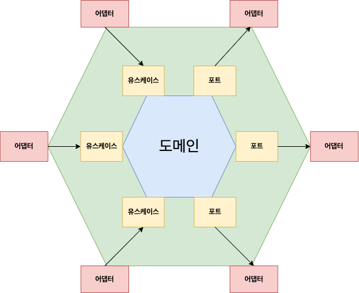
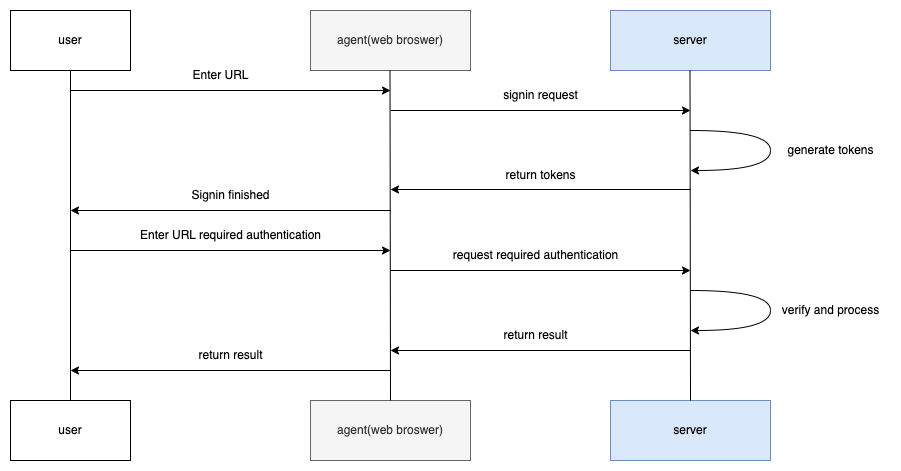

# project Tooth

## 프로젝트 개요
사용자 인증, 관리에 관한 기능을 구축하기 위해 적지 않는 시간이 요구됩니다. 
그래서 사용자 인증, 관리 기능들을 가진 앱을 미리 구축해두고 향후 신규프로젝트에 활용할수 있게 도와주는 프로젝트인 tooth를 시작하게 되었습니다.

## 프로젝트 구성
### [api](./api)
웹 요청을 처리하기 위한 엔드포인트(어댑터)를 관리합니다. 현재 다음의 2개의 모듈로 구성되어있습니다.
- [auth-local-jwt-api](./api/auth-local-jwt-api) (jwt 기반의 로컬 인증을 처리하는 엔드포인트)
- [member-api](./api/member-api) (유저의 정보수정, 조회를 위한 엔드포인트)

### [common](./common)
유틸, 공통으로 사용되는 클래스를 관리합니다.

### [domain](./domain)
육각형 아키텍처의 핵심인 도메인과, 도메인과의 요청을 위한 인터페이스(유스케이스, 포트)를 관리합니다.

### [infrastructure](./infrastructure)
도메인에서 어댑터에 요청하기 위한 포트의 구현체들을 관리합니다.
- [tooth-mariadb](./infrastructure/tooth-mariadb) (mariadb 데이터베이스 접근을 위한 어댑터)

### [service](./service)
어댑터에서 도메인에 요청하기 위한 유스케이스의 구현체들을 관리합니다.

## 아키텍처
### 3 tier 구조의 문제점
3계층 아키텍처는 애플리케이션을 프레젠테이션 계층, 비즈니스 로직 계층, 데이터 저장 계층의 세 가지 계층으로 분리하는 웹 애플리케이션 설계의 일반적인 접근 방식입니다. 애플리케이션을 각각 고유한 책임이 있는 세 개의 계층으로 명확하게 분리하므로 애플리케이션을 유지 관리하고 확장하기가 더 쉬운장점이 있습니다.
수년 동안 웹 애플리케이션 개발에 사용되어 온 잘 정립된 패턴이므로, 사용 방법을 배우고자 하는 개발자가 사용할 수 있는 리소스를 쉽게 찾을수 있는 장점이 있습니다.

하지만 3계층 아키텍처는 프리젠테이션 계층은 비즈니스 로직에 의존하고, 비즈니스 로직은 데이터 저장 계층에 의존하기 때문에 도메인 주도 설계가 아닌 데이터베이스 중심의 설계를 초래합니다. 예를 들어 만약 RDB를 사용하다 NOSQL로 전환한다면, 어플리케이션의 많은 수정이 필요할것입니다. 또한 아키텍처간 의존관계에 대한 개발팀의 규칙을 정하지 않으면, 웹계층에서 데이터계층에 의존하는등의 계층이 꼬이는문제가 발생하고이는 테스트와 계층간 분업의 복잡도를 증가시킬수 있습니다.

### Hexagonal 아키텍처와 DDD 도입


육각형 아키텍처는 고도로 분리되어 있어 애플리케이션의 한 부분을 변경해도 다른 부분에 영향을 미치지 않습니다. 따라서 애플리케이션을 테스트하고 유지 관리하기가 더 쉬운장점이 있습니다. 

Hexagonal 아키텍처의 도입은 자연스럽게 DDD를 유도하여 개발을 할수 있게 합니다. 도메인(상품관리, 진열관리, 재고관리 등등)에 집중하면서 모델링함으로써 개발자는 기술스택보다 비즈니스를 더 깊게 이해하는것이 가능합니다. 데이터베이스, 다른 API으로의 요청, 유스케이스(비즈니스로직)은 모두 도메인에 의존하도록 설계됩니다. 기술스택과 요구사항은 빠르게 변화하지만, 도메인은 가장 중심이 되고 쉽게 변하지 않으므로 원할한 유지보수와 기능개발을 돕습니다.

Hexagonal 아키텍처는 중심에 있는 도메인과, 요청을 받거나(ex: 컨트롤러) 외부에 요청하는(다른 API나 데이터베이스 jdbc, nosql) 엔드포인트인 어댑터로 구성됩니다. 어댑터가 도메인에 요청할때는 incoming의 역활을 하는 유스케이스, 도메인에서 다른 데이터베이스나 API등의 어댑터에 요청할때는 outcoming의 역활을 하는 포트를 사용합니다.

유스케이스와 포트는 모두 인터페이스 입니다. 어댑터가 도메인에 요청할때, 혹은 도메인에서 어댑터에 요청할때 모두 도메인에서 지정하는 인터페이스를 통해 요청하므로 모듈간 결합도를 낮출수 있습니다. 이는 어댑터의 기술스택의 교체(ex: rdb -> nosql)를 용이하게 하여 지속가능한 개발을 진행할수 있게 도와줍니다.

### JWT 기반의 로컬 인증 플로우

JWT(JSON WEB TOKEN)는 정보를 JSON을 사용하여 안전하게(손상, 위조여부 확인) 통신하기 위한 개방된 표준입니다. JWT는 웹 애플리케이션에서 인증 및 권한 부여 목적으로 자주 사용되고 있습니다.

JWT는 헤더, 페이로드, 서명의 세 부분으로 구성됩니다. 헤더는 토큰의 유형과 서명에 사용되는 알고리즘을 정의합니다. 페이로드에는 사용자와 관련된 정보와 추가로 필요로 하는 데이터들이 포함됩니다. JWT의 서명은 헤더와 페이로드정보를 기반으로 비밀키를 사용하여 생성됩니다. 이후 수신자가 헤더와 페이로드정보를 기반으로 비밀키를 사용하여 서명을 만든후 jwt토큰의 서명과 비교해보면 위조여부를 확인할수 있습니다.

## application.yml 설정 가이드
### 관계형 데이터베이스 구축하기
- infrastructre/tooth-mariadb 의 리소스 폴더에 flyway 마이그레이션을 위한 application.yml 작성
```
spring:
  datasource:
    url: <STRING>
    username: <STRING>
    password: <STRING>
    driver-class-name: org.mariadb.jdbc.Driver
  flyway:
    url: <STRING>
    user: <STRING>
    password: <STRING>
```
- infrastructre/tooth-mariadb 의 DBMigrationRunner.kt 실행


### 배포할 api의 리소스 폴더에 application.yml 작성
```
spring:
  datasource:
    url: <STRING>
    username: <STRING>
    password: <STRING>
    driver-class-name: org.mariadb.jdbc.Driver

tooth:
  jwt:
    secret: <STRING>
    refresh-token-secret: <STRING>
    access-token-expired-mile-seconds: <NUMBER>
    refresh-token-expired-mile-seconds: <NUMBER>

    role-key: 'ROLES'
    prefix: 'Bearer '

    local-member-access-token-for-test: jwt.io 등의 사이트를 통해 설정
    local-member-refresh-token-for-test: <STRING, 설정안해도됨>

  cors:
    allowed-origins: 'http://localhost:8080'
    allowed-methods: '*'
    allowed-headers: '*'
    exposed-headers: 'Authorization'
    max-age: 3600

  local:
    id-policy: 'EMAIL'

```
